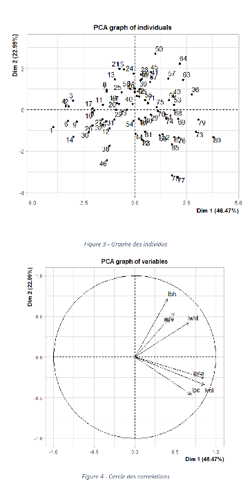

# Mathematics-for-DataScience

Detecting Prostate cancer using data science with R programming language.  
Master 1 project made for the Mathematics for Data Science cursus at Efrei Paris.  
Made by Da Cruz Mathis and Sivananthan Sarankan.

Here, some examples of plots we obtained :

